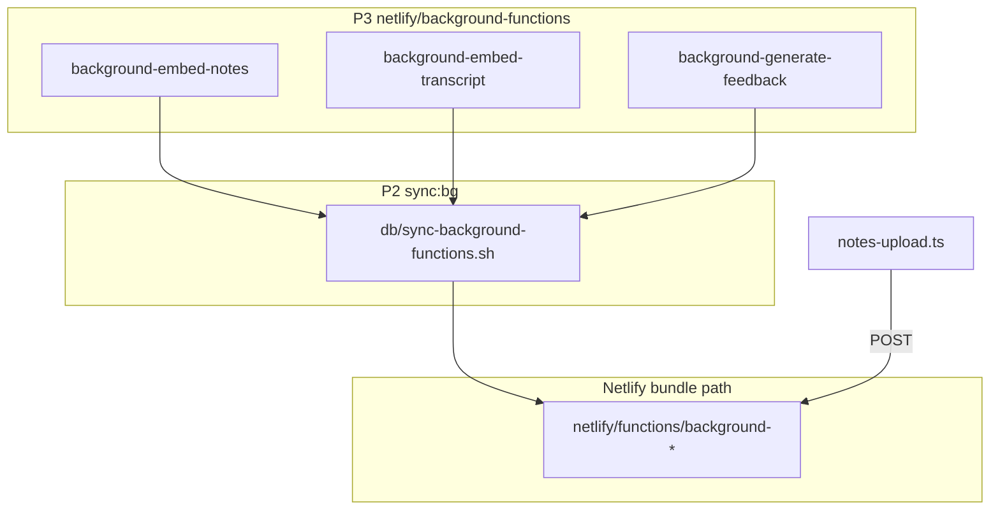

<!--
  OWNER: P2 (Backend)
  Lane handoff for branch feat/be-health. Lives under db/ per CLAUDE.md (P4 owns docs/).
-->

# P2 — Backend deliverables

This document explains everything implemented on branch **`feat/be-health`**: what changed, why, how it fits CLAUDE.md lanes, and how to verify it locally or in CI.

**P2 owns:** `netlify/functions/**`, `db/**`  
**Not modified:** `src/**`, `agents/**`, `agents/prompts/**`, `shared/types.ts`, `netlify.toml`

---

## Executive summary

| Deliverable | What it does |
|-------------|----------------|
| **Health function** | `GET /.netlify/functions/health` → `{ ok: true, ts }` for deploy/CI liveness |
| **Background sync** | Copies P3 handlers from `netlify/background-functions/` into `netlify/functions/` so Netlify actually deploys them |
| **Seed fix** | `npm run db:seed` is safe to run repeatedly (`KRSU-DEMO` session code) |
| **Smoke script** | `npm run smoke:api` curls the main REST surface on port 8888 |

The REST API handlers (`lectures`, `notes-upload`, `question-ask`, etc.) were **already written** before this branch; P2 work here is **plumbing, deploy correctness, and verification tooling**.

---

## Branch and scope

```bash
git checkout feat/be-health
```

### Files added or changed (P2)

| Path | Change |
|------|--------|
| `netlify/functions/health.ts` | **New** — health handler |
| `db/seed.ts` | **Fix** — `onConflictDoNothing` on `sessionCode` |
| `db/sync-background-functions.sh` | **New** — pre-dev/pre-build sync |
| `db/smoke-api.sh` | **New** — curl smoke tests |
| `db/P2.md` | **New** — this document |
| `package.json` | `sync:bg`, `smoke:api`; `dev` / `build` run sync first |
| `.gitignore` | Ignore synced `background-*.ts` copies under `netlify/functions/` |

### Intentionally unchanged (other lanes)

| Path | Owner | P2 action |
|------|--------|-----------|
| `netlify.toml` | P4 | **Not edited** — P4 should add `/api/health` redirect (see below) |
| `netlify/background-functions/*.ts` | P3 | **Restored in place** — source of truth for background job logic |
| `docs/**` | P4 | No handoff doc here (this file is under `db/`) |

---

## 1. Health endpoint

### File

[`netlify/functions/health.ts`](../netlify/functions/health.ts) — `OWNER: P2`

### Behavior

- **Methods:** `GET` (and `OPTIONS` for CORS via shared helpers)
- **Response `200`:**
  ```json
  { "ok": true, "ts": "2026-05-16T12:00:00.000Z" }
  ```
- **Other methods:** `405` via `methodNotAllowed()`
- Uses [`_lib/response.ts`](../netlify/functions/_lib/response.ts) (same CORS headers as the rest of the API)

### URLs

| URL | Status |
|-----|--------|
| `GET /.netlify/functions/health` | **Works today** (function route) |
| `GET /api/health` | **Needs P4** — add redirect in `netlify.toml` |

### P4 action (copy into `netlify.toml` before SPA fallback)

```toml
[[redirects]]
  from = "/api/health"
  to = "/.netlify/functions/health"
  status = 200
```

Then CI can use either URL; smoke script currently uses the function URL.

### Test

```bash
npm run dev   # runs sync:bg first, then netlify dev on :8888
curl -s http://localhost:8888/.netlify/functions/health | jq .
```

**Note:** `npm run dev:vite` (port 5173 only) does **not** serve functions — use full `npm run dev`.

### Contract

Health is **ops-only**. It is **not** in [`shared/types.ts`](../shared/types.ts) and does not require a team contract change.

---

## 2. Background functions — deploy fix (P3 source + P2 sync)

### The problem

Netlify is configured with a **single** functions directory:

```toml
# netlify.toml (P4-owned)
[build]
  functions = "netlify/functions"
```

Background jobs were authored under `netlify/background-functions/` (P3 lane per CLAUDE.md). Netlify **never bundled** those files, so these calls were no-ops in dev and production:

- `POST /.netlify/functions/background-embed-notes` ← [`notes-upload.ts`](../netlify/functions/notes-upload.ts)
- `POST /.netlify/functions/background-embed-transcript` ← [`transcript-append.ts`](../netlify/functions/transcript-append.ts)
- `POST /.netlify/functions/background-generate-feedback` ← [`lecture-end.ts`](../netlify/functions/lecture-end.ts)

### The solution (lane-compliant)

1. **P3 canonical sources** stay in `netlify/background-functions/`:
   - `background-embed-notes.ts` — chunk + Voyage embed notes → `note_chunks`
   - `background-embed-transcript.ts` — embed pending `transcript_segments`
   - `background-generate-feedback.ts` — Opus feedback report → `feedback_reports`

2. **P2 sync script** [`db/sync-background-functions.sh`](sync-background-functions.sh) copies them into `netlify/functions/` before dev/build and rewrites imports:

   ```diff
   - import { readJson } from '../functions/_lib/response';
   + import { readJson } from './_lib/response';
   ```

3. **Gitignore** synced copies so only one source tree is committed (P3 path).

4. **`package.json`** runs sync automatically:

   ```json
   "sync:bg": "bash db/sync-background-functions.sh",
   "dev": "npm run sync:bg && netlify dev",
   "build": "npm run sync:bg && vite build"
   ```

### Flow



### Manual sync

```bash
npm run sync:bg
```

Run this after pulling changes to `netlify/background-functions/` if you are not using `npm run dev` / `npm run build`.

### Verify embeddings work

Requires `VOYAGE_API_KEY` (and DB migrated). Upload notes on a lecture, then check `note_chunks` in psql.

---

## 3. Database seed — idempotent insert

### File

[`db/seed.ts`](seed.ts)

### Problem

`.onConflictDoNothing()` without a target could fail on the second run when `session_code = 'KRSU-DEMO'` already exists (unique index).

### Fix

```ts
.onConflictDoNothing({ target: lectures.sessionCode });
```

### What gets inserted

| Column | Value |
|--------|--------|
| `teacherId` | `teacher_demo_001` |
| `title` | Ridge Regresyon Nedir? |
| `subject` | Makine Öğrenmesi |
| `status` | `draft` |
| `sessionCode` | `KRSU-DEMO` |

### Commands

```bash
# NETLIFY_DATABASE_URL must be set
npm run db:migrate
npm run db:seed
```

### Future work (P2 + P4)

`db/seed.ts` still has a TODO for a **full backup demo**: pre-loaded notes, transcript, Q&A, and feedback on `KRSU-DEMO` for venue failover (needs P4’s 2-page PDF + script).

---

## 4. API smoke script

### File

[`db/smoke-api.sh`](smoke-api.sh) — executable, `OWNER: P2`

### Run

```bash
npm run dev          # terminal 1
npm run smoke:api    # terminal 2

# Against production:
BASE_URL=https://your-site.netlify.app npm run smoke:api
```

### Checks

| Step | Request | Expected |
|------|---------|----------|
| Health | `GET /.netlify/functions/health` | 200, `"ok":true` |
| List lectures | `GET /api/lectures` | 200 |
| Demo by code | `GET /api/lectures/by-code/KRSU-DEMO` | 200 if seeded; warns if 404 |
| Create | `POST /api/lectures` | 201 + `id` |
| Get by id | `GET /api/lectures/:id` | 200 |
| Student join | `POST .../student-join` | 200 |
| List questions | `GET .../questions` | 200 |

Exit code `0` = all passed; `1` = at least one failure.

**Requires:** `python3` for JSON parsing in bash.

**Not covered yet:** SSE `POST .../questions`, PDF upload, feedback 202→200 polling.

---

## 5. Existing API (unchanged on this branch)

These handlers were already in the repo; P2 did not rewrite their business logic:

| Function file | Public route (via `netlify.toml` redirects) |
|---------------|-----------------------------------------------|
| `lectures.ts` | `POST/GET /api/lectures` |
| `lecture-by-id.ts` | `GET /api/lectures/:id` |
| `lecture-by-code.ts` | `GET /api/lectures/by-code/:code` |
| `notes-upload.ts` | `POST /api/lectures/:id/notes` |
| `lecture-start.ts` | `POST /api/lectures/:id/start` |
| `lecture-end.ts` | `POST /api/lectures/:id/end` |
| `transcript-append.ts` | `POST .../transcript/append` |
| `transcript-get.ts` | `GET .../transcript` |
| `student-join.ts` | `POST .../student-join` |
| `question-ask.ts` | `POST .../questions` (SSE) |
| `questions-list.ts` | `GET .../questions` |
| `question-teacher-respond.ts` | `POST /api/questions/:id/teacher-response` |
| `feedback-get.ts` | `GET .../feedback` |

Wire contract: [`shared/types.ts`](../shared/types.ts).

---

## Manual setup checklist (P2 + P4)

| # | Step | Who |
|---|------|-----|
| 1 | `npx netlify init` — link site | P2 / P4 |
| 2 | Enable **Netlify DB** add-on | P4 |
| 3 | Set `ANTHROPIC_API_KEY`, `VOYAGE_API_KEY` in Netlify + `.env.local` | P4 / P3 |
| 4 | `npm run db:migrate` — tables + pgvector HNSW | P2 |
| 5 | `npm run db:seed` — `KRSU-DEMO` row | P2 |
| 6 | Add `/api/health` redirect to `netlify.toml` | P4 |
| 7 | `npm run dev` → `npm run smoke:api` | P2 |
| 8 | SSE test (needs AI keys) — see below | P2 / P3 |

### psql after migrate

```sql
\d note_chunks
-- Expect embedding vector(1024) and HNSW index from db/migrations/0000_initial.sql
```

### SSE sanity curl

```bash
curl -N -X POST "http://localhost:8888/api/lectures/<LECTURE_ID>/questions" \
  -H "content-type: application/json" \
  -d '{"studentSessionId":"<SESSION_ID>","questionText":"Lambda büyürse modele ne olur?"}'
```

---

## Verification notes

- **TypeScript:** `npx tsc --noEmit` reports no errors under `netlify/` or `db/`. Full `npm run typecheck` may still fail on pre-existing `src/` issues (P1).
- **Node:** Use **Node 20** per `netlify.toml`. `netlify-cli` postinstall can fail on Node 25; try `npm install --ignore-scripts` if needed.
- **Local functions:** Synced `background-*.ts` files are generated locally and gitignored — always run `npm run sync:bg` (or `npm run dev`) before expecting background jobs to work.

---

## CLAUDE.md compliance

| Rule | How this branch respects it |
|------|-----------------------------|
| P2 owns `netlify/functions/**`, `db/**` | Health + sync + seed + smoke + this doc |
| P3 owns `netlify/background-functions/**` | Sources unchanged; only P2 sync copies for deploy |
| P4 owns `netlify.toml`, `docs/**` | No edits to those paths |
| No `shared/types.ts` without team agreement | Not touched |
| No `src/**` | Not touched |
| Background = 15 min budget | Still `background-*` function names after sync |

---

## Suggested next steps

1. **P4:** Merge redirect for `/api/health`; confirm CI hits it after deploy.
2. **P2:** Rich `KRSU-DEMO` seed with P4 demo PDF/script.
3. **P2:** Extend `smoke-api.sh` for SSE + notes upload.
4. **Team:** Merge `feat/be-health` → `main` after review.

---

## Questions?

- API shape changes → team channel + `shared/types.ts` together.
- Background **logic** bugs → P3 (`agents/`, `netlify/background-functions/`).
- Deploy / env / redirects → P4 (`netlify.toml`, Netlify UI).
